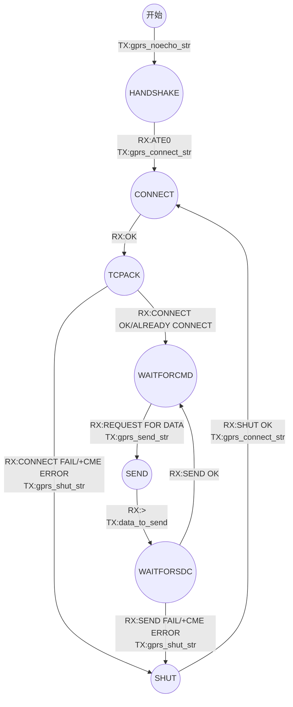

本方案使用了有限状态机的思路。  
有限状态机，又称有限状态自动机，简称状态机，是表示有限个状态以及在这些状态之间的转移和动作等行为的数学模型。  
将GPRS模块不同的工作阶段看作不同的状态，通过发送并接收不同的指令来完成状态间的转换。定义状态转移图如下：  

+ HANDSHAKE状态  
等待握手的状态。理论上来讲在一开始发送gprs_noecho_str指令后应该收到ATE0 OK就代表单片机和模块通讯上了，并且之后模块不再复述所发送的指令，不过实际上收到的有可能会是ATE0K类似这样奇怪的数，中间的部分被吃掉了一样，可能是模块的bug，不过不影响，我们只需要判断有没有返回ATE0就可以了。收到ATE0后向模块发送请求连接指令gprs_connect_str。  
+ CONNECT状态  
等待连接的状态。模块返回OK仅代表模块收到了连接指令，然后模块自己发起连接，进入下一状态。  
+ TCPACK状态  
等待连接上的状态。模块返回CONNECT OK或ALREADY CONNECT代表模块自己已经连接上了服务器，进入下一状态。  
+ WAITFORCMD状态  
等待服务器发来触发指令的状态，模块返回REQUEST FOR DATA即服务器发来的触发指令后，向模块发送请求发送指令gprs_send_str，进入下一状态。  
+ SEND状态  
等待模块准备好发送的状态，模块返回>代表已经可以发送了，向模块发送data_to_send即数据，进入下一状态  
+ WAITFORSDC状态  
等待模块发送成功的状态，模块返回SEND OK代表模块向服务器发送数据成功，回到WAITFORCMD状态。  
+ SHUT状态  
不论何时收到+PDP: DEACT、或者在TCPACK状态下收到CONNECT FAIL或+CME ERROR，或者在WAITFORSDC状态下收到SEND FAIL或+CME ERROR都会向模块发送gprs_shut_str指令进入SHUT状态。在SHUT状态下模块返回SHUT OK即成功关闭连接，向模块发送gprs_connect_str指令进入等待连接状态TCPACK。  

附：代码实现  
```c
enum{
  HANDSHAKE = 0,
  CONNECT,
  TCPACK,
  SHUT,
  WAITFORCMD,
  SEND,
  WAITFORSDC
 };

uint8_t GPRSSTATE = 0;

char gprs_noecho_str[] = "ATE0\r\n";
char gprs_connect_str[] = "AT+CIPSTART=\"TCP\",\"xxx.xxx.xxx.xxx\",\"50000\"\r\n";
char gprs_send_str[] = "AT+CIPSEND=81\r\n";
char gprs_disconnect_str[] = "AT+CIPCLOSE\r\n";
char gprs_shut_str[] = "AT+CIPSHUT\r\n";
uint8_t data_to_send[SUB_BOARD][81];

/* FUNC_GPRS function */
void FUNC_GPRS(void const * argument)
{
  /*USER CODE BEGIN FUNC_GPRS*/
	int send_count = 0, send_flag = 0;
	BaseType_t pdsem = pdFALSE;
	HAL_UART_Receive_DMA(&huart1,gprs_rxbuf,BUFFER_SIZE);
	osDelay(20000);
	HAL_UART_Transmit(&huart1,(uint8_t *)gprs_noecho_str,strlen(gprs_noecho_str),1000);
  /*Infinite loop*/
 for(;;)
  {
    pdsem = xSemaphoreTake(BinarySem_gprsHandle,portMAX_DELAY);
		if(pdsem == pdTRUE)
		{
			if((strstr((char *)gprs_rxbuf,"+PDP: DEACT") != NULL) || (strstr((char *)gprs_rxbuf,"CLOSED") != NULL))
			{
				GPRSSTATE = SHUT;
				HAL_UART_Transmit(&huart1,(uint8_t *)gprs_shut_str,strlen(gprs_shut_str),1000);
			}
			else
			{
				switch(GPRSSTATE)
				{
					case CONNECT:
					{
						if(strstr((char *)gprs_rxbuf,"OK") != NULL)
							GPRSSTATE = TCPACK;
						break;
					}
					case TCPACK:
					{
						if(strstr((char *)gprs_rxbuf,"CONNECT OK") || (strstr((char *)gprs_rxbuf,"ALREADY CONNECT") != NULL))
							GPRSSTATE = WAITFORCMD;
						else if(strstr((char *)gprs_rxbuf,"CONNECT FAIL") || (strstr((char *)gprs_rxbuf,"+CME ERROR") != NULL))
						{
							GPRSSTATE = SHUT;
							HAL_UART_Transmit(&huart1,(uint8_t *)gprs_shut_str,strlen(gprs_shut_str),1000);
						}
						break;
					}
					case HANDSHAKE:
					{
						if(strstr((char *)gprs_rxbuf,"ATE0") != NULL)
						{
							GPRSSTATE = CONNECT;
							HAL_UART_Transmit(&huart1,(uint8_t *)gprs_connect_str,strlen(gprs_connect_str),1000);
						}
						break;
					}
					case SHUT:
					{
						osDelay(5000);
						if(strstr((char *)gprs_rxbuf,"SHUT OK") != NULL)
						{
							GPRSSTATE = CONNECT;
							HAL_UART_Transmit(&huart1,(uint8_t *)gprs_connect_str,strlen(gprs_connect_str),1000);
						}
						break;
					}
					case WAITFORCMD:
					{
						if(gprs_rxlen >= 17)
            //由于参数是portMAX_DELAY，能走到这里肯定代表收到了数，更新了gprs_rxlen
            //加上这个>= 17的判断是为了防止后面的strstr函数出错，毕竟长度小于17的话肯定不包含触发指令咯
						{
							if(strstr((char *)gprs_rxbuf,"REQUEST FOR DATA!") != NULL)
							{
								xSemaphoreGive(CountingSem_canHandle);
								GPRSSTATE = SEND;
								HAL_UART_Transmit(&huart1,(uint8_t *)gprs_send_str,strlen(gprs_send_str),1000);
								HAL_GPIO_WritePin(GPIOD, GPIO_PIN_7, GPIO_PIN_SET);
							}
						}
						else if(send_flag == 1)
						{
								GPRSSTATE = SEND;
								HAL_UART_Transmit(&huart1,(uint8_t *)gprs_send_str,strlen(gprs_send_str),1000);
								HAL_GPIO_WritePin(GPIOD, GPIO_PIN_7, GPIO_PIN_SET);
						}
						break;
					}
					case SEND:
					{
						if(strstr((char *)gprs_rxbuf,">") != NULL)
						{
							GPRSSTATE = WAITFORSDC;
							HAL_UART_Transmit(&huart1,&data_to_send[send_count][0],81,1000);
							send_count ++;
						}
						break;
					}
					case WAITFORSDC:
					{
						if(strstr((char *)gprs_rxbuf,"SEND OK") != NULL)
						{
							GPRSSTATE = WAITFORCMD;
							if(send_count <  SUB_BOARD)
							{
								osDelay(1000);
								send_flag = 1;
								xSemaphoreGive(BinarySem_gprsHandle);
							}
							else
							{
								send_count = 0;
								send_flag = 0;
							}
						}
						else if((strstr((char *)gprs_rxbuf,"SEND FAIL") != NULL) || (strstr((char *)gprs_rxbuf,"+CME ERROR") != NULL))
						{
							GPRSSTATE = SHUT;
							HAL_UART_Transmit(&huart1,(uint8_t *)gprs_shut_str,strlen(gprs_shut_str),1000);
						}
						break;
					}
					default: break;
				}
			}
		}
		memset(gprs_rxbuf,0,sizeof(gprs_rxbuf));
		HAL_UART_Receive_DMA(&huart1,gprs_rxbuf,BUFFER_SIZE);
  }
}
```
